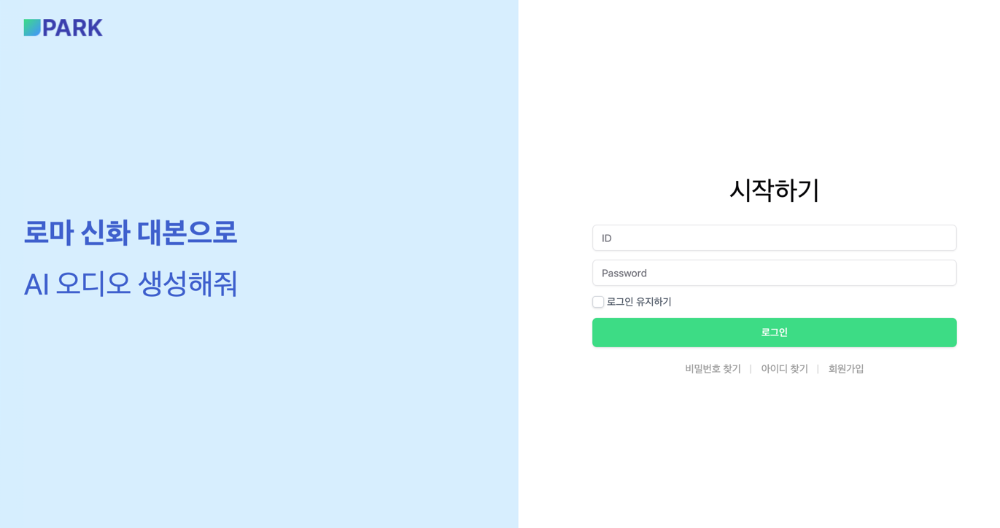
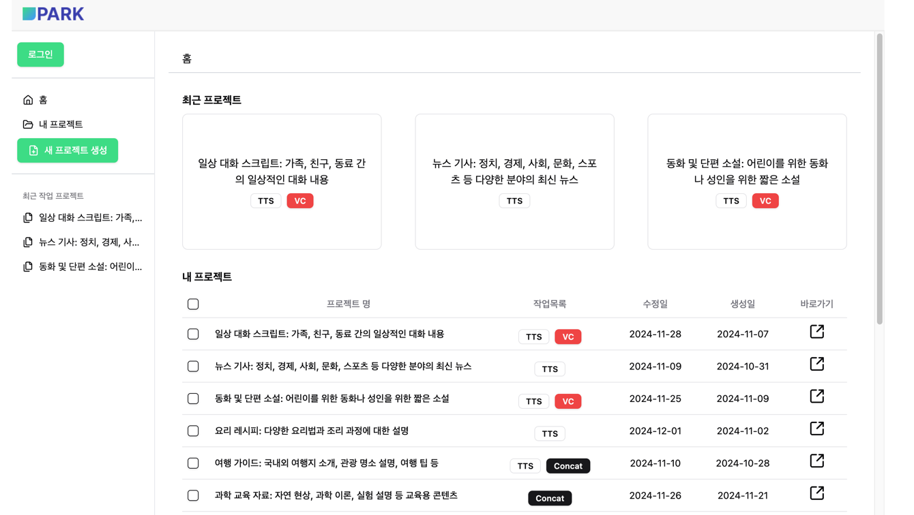

# 5RE5 PARK 

 

 

## 프로젝트 소개

 

### 🏃🏻 프로젝트 기간 (54 days)
> **전체 개발 기간:  ( 8 Weeks | 45 %)**  
> - 기능 구현 기간:  ( 5 Weeks | 60 %)
> - 발표 준비 기간:  3 days 

 

### 💻 코드수
<pre><code>
Java         : 33,731  
</code></pre> 

 

### 👫 프로젝트 팀원

#### 팀명: 5RE5

#### 팀원 구성

|                Backend 박준홍 \| 팀장                |                   Backend 이종헌                   |                   Backend 유민우                   |         Backend 최윤서         |         Backend 김규영          |         Backend 류은기         |
|:--------------------------------------------------:|:--------------------------------------------------:|:--------------------------------------------------:|:------------------------------:|:-------------------------------:|:------------------------------:|
|                          |                      |                      |  |   |  |

 

## 기술 스택

### 🧑🏻‍💻 Enviroment
|IntelliJ|VS Code|Git|Github|Gradle|
|:---:|:---:|:---:|:---:|:---:|
||||||

 

### 🛠️ Tool

#### Backend
|Java|                    Spring Framework                    |                                   Spring Security                                    |                                   JPA                                    |                         Lombok                         |jUnit|
|:---:|:------------------------------------------------------:|:------------------------------------------------------------------------------------:|:------------------------------------------------------------------------:|:------------------------------------------------------:|:---:|
||  |  |  |  ||

#### Database
|MySQL|
|:---:|
||

#### Web Server
|Apache Tomcat|                                                            AWS                                                             |                               RDS                               |Prometheus|Grafana|Docker|                         Compose                          |GitHub Action|
|:---:|:--------------------------------------------------------------------------------------------------------------------------:|:---------------------------------------------------------------:|:---:|:---:|:---:|:--------------------------------------------------------:|:---:|
||  |  ||||  ||

 

### 👀 Communication
|                        Zoom                        |Notion|                            Google Sheets                            |                            Google Slides                             |
|:--------------------------------------------------:|:---:|:-------------------------------------------------------------------:|:--------------------------------------------------------------------:|
|  ||  |  |

 

 
 

## Commit Message Convention
### 📋 규칙
<pre><code>- 제목 행 명령문 사용
- 제목과 본문을 빈 행으로 분리
- 제목 행 글자 수 50자 이하
- 제목 행 끝에 마침표 없음</code></pre>

### 📝 유형

<pre><code>
[feat]        :     새로운 기능 추가
[test]        :     테스트 코드 완료 
[refactor]    :     리팩토링, 코드 개선
[fix]         :     버그 수정
[docs]        :     문서 추가 또는 수정 (ex. README 변경)
[style]       :     코드 스타일 변경 (포맷팅, 세미콜론 누락 등 코드 변경이 없는 경우)
[chore]       :     패키지 매니저(ex. gitignore 수정), 빌드 업무 수정
[comment]     :     주석 추가 및 수정
[rename]      :     파일 또는 폴더명을 수정하거나 이동하는 작업만 수행한 경우
[remove]      :     파일을 삭제하는 작업만 수행한 경우
[conflict]    :     합병 시 발생한 충돌 수정
</code></pre>

## 🏭 디렉토리 구조
<pre><code>
src
├── main
│   ├── java
│   │   └── com
│   │       └── oreo
│   │           └── finalproject_5re5_be
│   │               ├── FinalProject5Re5BeApplication.java
│   │               ├── code
│   │               │   ├── controller
│   │               │   │   ├── CodeController.java
│   │               │   │   └── advice
│   │               │   │       └── CodeExceptionHandler.java
│   │               │   ├── dto
│   │               │   │   ├── request
│   │               │   │   │   ├── CodeRequest.java
│   │               │   │   │   └── CodeUpdateRequest.java
│   │               │   │   └── response
│   │               │   │       ├── CodeResponse.java
│   │               │   │       └── CodeResponses.java
│   │               │   ├── entity
│   │               │   │   └── Code.java
│   │               │   ├── exeption
│   │               │   │   ├── CodeDuplicatedException.java
│   │               │   │   └── CodeNotFoundException.java
│   │               │   ├── repository
│   │               │   │   └── CodeRepository.java
│   │               │   └── service
│   │               │       └── CodeServiceImpl.java
│   │               ├── concat
│   │               │   ├── config
│   │               │   │   └── README.md
│   │               │   ├── controller
│   │               │   │   ├── AudioFileController.java
│   │               │   │   ├── BgmFileController.java
│   │               │   │   ├── ConcatController.java
│   │               │   │   ├── ConcatMaterialController.java
│   │               │   │   ├── ConcatRowController.java
│   │               │   │   ├── ConcatRowTabController.java
│   │               │   │   ├── ConcatTabController.java
│   │               │   │   └── ConcatWithBgmController.java
│   │               │   ├── dto
│   │               │   │   ├── ConcatResponseDto.java
│   │               │   │   ├── ConcatResultDto.java
│   │               │   │   ├── ConcatRowDto.java
│   │               │   │   ├── ConcatRowListDto.java
│   │               │   │   ├── RowAudioFileDto.java
│   │               │   │   ├── RowInfoDto.java
│   │               │   │   ├── request
│   │               │   │   │   ├── AudioFileDto.java
│   │               │   │   │   ├── AudioFileRequestDto.java
│   │               │   │   │   ├── AudioFormatRequest.java
│   │               │   │   │   ├── BgmFunctionRequestDto.java
│   │               │   │   │   ├── ConcatCreateRequestDto.java
│   │               │   │   │   ├── ConcatResultRequest.java
│   │               │   │   │   ├── ConcatRowRequest.java
│   │               │   │   │   ├── ConcatRowRequestDto.java
│   │               │   │   │   ├── ConcatRowSaveRequestDto.java
│   │               │   │   │   ├── ConcatTabRequest.java
│   │               │   │   │   ├── ConcatUpdateRequestDto.java
│   │               │   │   │   ├── OriginAudioRequest.java
│   │               │   │   │   ├── README.md
│   │               │   │   │   ├── SelectedConcatRowRequest.java
│   │               │   │   │   └── TabRowUpdateRequestDto.java
│   │               │   │   └── response
│   │               │   │       ├── ConcatResultDetailsResponse.java
│   │               │   │       ├── ConcatResultResponse.java
│   │               │   │       ├── ConcatRowTabResponseDto.java
│   │               │   │       ├── ConcatTabResponseDto.java
│   │               │   │       ├── ConcatUrlResponse.java
│   │               │   │       ├── README.md
│   │               │   │       └── TabRowResponseDto.java
│   │               │   ├── entity
│   │               │   │   ├── AudioFile.java
│   │               │   │   ├── BgmFile.java
│   │               │   │   ├── ConcatResult.java
│   │               │   │   ├── ConcatRow.java
│   │               │   │   ├── ConcatRowLog.java
│   │               │   │   ├── ConcatTab.java
│   │               │   │   ├── ConcatTabLog.java
│   │               │   │   └── MaterialAudio.java
│   │               │   ├── exception
│   │               │   │   └── README.md
│   │               │   ├── repository
│   │               │   │   ├── AudioFileRepository.java
│   │               │   │   ├── BgmFileRepository.java
│   │               │   │   ├── ConcatResultRepository.java
│   │               │   │   ├── ConcatRowLogRepository.java
│   │               │   │   ├── ConcatRowRepository.java
│   │               │   │   ├── ConcatTabLogRepository.java
│   │               │   │   ├── ConcatTabRepository.java
│   │               │   │   └── MaterialAudioRepository.java
│   │               │   └── service
│   │               │       ├── AudioFileService.java
│   │               │       ├── AudioMultipartFile.java
│   │               │       ├── AudioStreamService.java
│   │               │       ├── BgmFileService.java
│   │               │       ├── ConcatResultService.java
│   │               │       ├── ConcatRowService.java
│   │               │       ├── ConcatRowTabService.java
│   │               │       ├── ConcatService.java
│   │               │       ├── ConcatTabService.java
│   │               │       ├── MaterialAudioService.java
│   │               │       ├── README.md
│   │               │       ├── bgm
│   │               │       │   └── BgmProcessor.java
│   │               │       ├── concatenator
│   │               │       │   ├── AudioProperties.java
│   │               │       │   ├── Concatenator.java
│   │               │       │   ├── IntervalConcatenator.java
│   │               │       │   ├── MonoConcatenator.java
│   │               │       │   ├── MonoIntervalConcatenator.java
│   │               │       │   ├── StereoConcatenator.java
│   │               │       │   └── StereoIntervalConcatenator.java
│   │               │       └── helper
│   │               │           ├── AudioFileHelper.java
│   │               │           ├── ConcatRowHelper.java
│   │               │           └── ConcatTabHelper.java
│   │               ├── global
│   │               │   ├── component
│   │               │   │   ├── AudioInfo.java
│   │               │   │   ├── ByteArrayMultipartFile.java
│   │               │   │   ├── S3Service.java
│   │               │   │   ├── SqsService.java
│   │               │   │   └── audio
│   │               │   │       ├── AudioChannels.java
│   │               │   │       ├── AudioExtensionChecker.java
│   │               │   │       ├── AudioExtensionConverter.java
│   │               │   │       ├── AudioExtensions.java
│   │               │   │       ├── AudioFileTypeConverter.java
│   │               │   │       ├── AudioFormats.java
│   │               │   │       ├── AudioResample.java
│   │               │   │       ├── BeepMaker.java
│   │               │   │       └── SoundPlayer.java
│   │               │   ├── config
│   │               │   │   ├── AuditorAwareImpl.java
│   │               │   │   ├── JpaAuditingConfig.java
│   │               │   │   ├── MultipartFileAccepter.java
│   │               │   │   ├── S3Config.java
│   │               │   │   ├── SqsConfig.java
│   │               │   │   └── SwaggerConfig.java
│   │               │   ├── constant
│   │               │   │   ├── BatchProcessType.java
│   │               │   │   └── MessageType.java
│   │               │   ├── dto
│   │               │   │   ├── request
│   │               │   │   │   └── SqsRequestDto.java
│   │               │   │   └── response
│   │               │   │       ├── AudioFileInfo.java
│   │               │   │       ├── ErrorResponseDto.java
│   │               │   │       └── ResponseDto.java
│   │               │   ├── entity
│   │               │   │   └── BaseEntity.java
│   │               │   ├── error
│   │               │   │   └── README.md
│   │               │   └── exception
│   │               │       ├── BusinessException.java
│   │               │       ├── DataNotFoundException.java
│   │               │       ├── EntityNotFoundException.java
│   │               │       ├── ErrorCode.java
│   │               │       ├── GlobalExceptionHandler.java
│   │               │       ├── InValidValueException.java
│   │               │       ├── README.md
│   │               │       └── RestGlobalExceptionHandler.java
│   │               ├── member
│   │               │   ├── config
│   │               │   │   ├── LoginAuthenticationFailureHandler.java
│   │               │   │   ├── LoginAuthenticationSuccessHandler.java
│   │               │   │   ├── MemberConfig.java
│   │               │   │   └── MemberSecurityConfig.java
│   │               │   ├── controller
│   │               │   │   ├── MemberController.java
│   │               │   │   ├── MemberTermConditionController.java
│   │               │   │   ├── MemberTermsController.java
│   │               │   │   ├── TestController.java
│   │               │   │   └── advice
│   │               │   │       └── MemberExceptionHandler.java
│   │               │   ├── dto
│   │               │   │   ├── CustomUserDetails.java
│   │               │   │   ├── request
│   │               │   │   │   ├── MemberChangePasswordRequest.java
│   │               │   │   │   ├── MemberRegisterRequest.java
│   │               │   │   │   ├── MemberRemoveRequest.java
│   │               │   │   │   ├── MemberTermCheckOrNotRequest.java
│   │               │   │   │   ├── MemberTermConditionRequest.java
│   │               │   │   │   ├── MemberTermConditionUpdateRequest.java
│   │               │   │   │   ├── MemberTermRequest.java
│   │               │   │   │   ├── MemberTermUpdateRequest.java
│   │               │   │   │   └── MemberUpdateRequest.java
│   │               │   │   └── response
│   │               │   │       ├── ErrorResponse.java
│   │               │   │       ├── MemberReadResponse.java
│   │               │   │       ├── MemberRegisterResponse.java
│   │               │   │       ├── MemberResponse.java
│   │               │   │       ├── MemberTermConditionResponse.java
│   │               │   │       ├── MemberTermConditionResponses.java
│   │               │   │       ├── MemberTermResponse.java
│   │               │   │       ├── MemberTermResponses.java
│   │               │   │       └── MemberTermsDetailResponse.java
│   │               │   ├── entity
│   │               │   │   ├── Member.java
│   │               │   │   ├── MemberCategory.java
│   │               │   │   ├── MemberChangeHistory.java
│   │               │   │   ├── MemberConnectionHistory.java
│   │               │   │   ├── MemberDelete.java
│   │               │   │   ├── MemberRoles.java
│   │               │   │   ├── MemberRolesCategory.java
│   │               │   │   ├── MemberState.java
│   │               │   │   ├── MemberTerms.java
│   │               │   │   ├── MemberTermsCondition.java
│   │               │   │   └── MemberTermsHistory.java
│   │               │   ├── exception
│   │               │   │   ├── DeletedMemberException.java
│   │               │   │   ├── HumanMemberException.java
│   │               │   │   ├── MemberDuplicatedEmailException.java
│   │               │   │   ├── MemberDuplicatedIdException.java
│   │               │   │   ├── MemberDuplicatedPasswordException.java
│   │               │   │   ├── MemberInvalidTermConditionException.java
│   │               │   │   ├── MemberMandatoryTermNotAgreedException.java
│   │               │   │   ├── MemberNotFoundEmailException.java
│   │               │   │   ├── MemberNotFoundException.java
│   │               │   │   ├── MemberTermInvalidException.java
│   │               │   │   ├── MemberTermsConditionNotFoundException.java
│   │               │   │   ├── MemberTermsNotFoundException.java
│   │               │   │   ├── MemberWrongCountTermCondition.java
│   │               │   │   ├── RestrictedMemberException.java
│   │               │   │   └── RetryFailedException.java
│   │               │   ├── repository
│   │               │   │   ├── MemberCategoryRepository.java
│   │               │   │   ├── MemberChangeHistoryRepository.java
│   │               │   │   ├── MemberConnectionHistoryRepository.java
│   │               │   │   ├── MemberDeleteRepository.java
│   │               │   │   ├── MemberRepository.java
│   │               │   │   ├── MemberStateRepository.java
│   │               │   │   ├── MemberTermConditionRepository.java
│   │               │   │   ├── MemberTermsHistoryRepository.java
│   │               │   │   └── MemberTermsRepository.java
│   │               │   └── service
│   │               │       ├── MemberServiceImpl.java
│   │               │       ├── MemberTermsConditionServiceImpl.java
│   │               │       └── MemberTermsServiceImpl.java
│   │               ├── project
│   │               │   ├── config
│   │               │   │   └── README.md
│   │               │   ├── controller
│   │               │   │   └── ProjectController.java
│   │               │   ├── dto
│   │               │   │   ├── request
│   │               │   │   │   └── ProjectTextRequest.java
│   │               │   │   └── response
│   │               │   │       └── ProjectResponse.java
│   │               │   ├── entity
│   │               │   │   ├── Project.java
│   │               │   │   └── ProjectStatus.java
│   │               │   ├── exception
│   │               │   │   ├── InvalidProjectNameException.java
│   │               │   │   ├── ProjectExceptionHandler.java
│   │               │   │   ├── ProjectNotFoundException.java
│   │               │   │   └── projectNotMemberException.java
│   │               │   ├── repository
│   │               │   │   └── ProjectRepository.java
│   │               │   └── service
│   │               │       ├── ProjectService.java
│   │               │       └── ProjectServiceImpl.java
│   │               ├── tts
│   │               │   ├── client
│   │               │   │   ├── AudioConfigGenerator.java
│   │               │   │   ├── GoogleTTSConfig.java
│   │               │   │   ├── GoogleTTSService.java
│   │               │   │   ├── SynthesisInputGenerator.java
│   │               │   │   └── VoiceParamsGenerator.java
│   │               │   ├── config
│   │               │   │   └── README.md
│   │               │   ├── controller
│   │               │   │   ├── LanguageController.java
│   │               │   │   ├── StyleController.java
│   │               │   │   ├── TtsController.java
│   │               │   │   └── VoiceController.java
│   │               │   ├── dto
│   │               │   │   ├── external
│   │               │   │   │   ├── TtsMakeRequest.java
│   │               │   │   │   ├── TtsMakeResponse.java
│   │               │   │   │   └── common
│   │               │   │   │       ├── AudioOptionDto.java
│   │               │   │   │       ├── TtsSentenceDto.java
│   │               │   │   │       └── VoiceDto.java
│   │               │   │   ├── request
│   │               │   │   │   ├── TtsAttributeInfo.java
│   │               │   │   │   ├── TtsAudioFileInfo.java
│   │               │   │   │   ├── TtsSentenceBatchInfo.java
│   │               │   │   │   ├── TtsSentenceBatchRequest.java
│   │               │   │   │   └── TtsSentenceRequest.java
│   │               │   │   └── response
│   │               │   │       ├── LanguageDto.java
│   │               │   │       ├── LanguageListDto.java
│   │               │   │       ├── SentenceInfo.java
│   │               │   │       ├── StyleDto.java
│   │               │   │       ├── StyleListDto.java
│   │               │   │       ├── TtsProgressStatusDto.java
│   │               │   │       ├── TtsSentenceDto.java
│   │               │   │       ├── TtsSentenceListDto.java
│   │               │   │       ├── VoiceDto.java
│   │               │   │       └── VoiceListDto.java
│   │               │   ├── entity
│   │               │   │   ├── Language.java
│   │               │   │   ├── SampleAudio.java
│   │               │   │   ├── ServerCode.java
│   │               │   │   ├── Style.java
│   │               │   │   ├── TtsAudioFile.java
│   │               │   │   ├── TtsProcessHistory.java
│   │               │   │   ├── TtsProgressStatus.java
│   │               │   │   ├── TtsProgressStatusCode.java
│   │               │   │   ├── TtsSentence.java
│   │               │   │   └── Voice.java
│   │               │   ├── exception
│   │               │   │   ├── DuplicatedSentenceException.java
│   │               │   │   ├── InValidRequestException.java
│   │               │   │   ├── InvalidTTSParamException.java
│   │               │   │   ├── ProjectMismatchException.java
│   │               │   │   ├── SaveTtsMakeResultException.java
│   │               │   │   ├── TtsMakeException.java
│   │               │   │   ├── TtsMakeInvalidParamException.java
│   │               │   │   ├── TtsSentenceInValidInput.java
│   │               │   │   ├── TtsSentenceNotFound.java
│   │               │   │   └── VoiceEntityNotFound.java
│   │               │   ├── repository
│   │               │   │   ├── LanguageRepository.java
│   │               │   │   ├── SampleAudioRepository.java
│   │               │   │   ├── StyleRepository.java
│   │               │   │   ├── TtsAudioFileRepository.java
│   │               │   │   ├── TtsProcessHistoryRepository.java
│   │               │   │   ├── TtsProgressStatusRepository.java
│   │               │   │   ├── TtsSentenceRepository.java
│   │               │   │   └── VoiceRepository.java
│   │               │   ├── service
│   │               │   │   ├── LanguageService.java
│   │               │   │   ├── SaveTtsMakeResultService.java
│   │               │   │   ├── StyleService.java
│   │               │   │   ├── TtsMakeService.java
│   │               │   │   ├── TtsSentenceService.java
│   │               │   │   ├── TtsSentenceServiceImpl.java
│   │               │   │   └── VoiceService.java
│   │               │   └── util
│   │               │       └── TtsSentenceComparator.java
│   │               └── vc
│   │                   ├── config
│   │                   │   └── README.md
│   │                   ├── controller
│   │                   │   └── VcController.java
│   │                   ├── dto
│   │                   │   ├── request
│   │                   │   │   ├── VcAudioRequest.java
│   │                   │   │   ├── VcRequestHistoryRequest.java
│   │                   │   │   ├── VcResultHistoryRequest.java
│   │                   │   │   ├── VcResultsRequest.java
│   │                   │   │   ├── VcRowRequest.java
│   │                   │   │   ├── VcSrcRequest.java
│   │                   │   │   ├── VcSrcsRequest.java
│   │                   │   │   ├── VcTextRequest.java
│   │                   │   │   └── VcUrlRequest.java
│   │                   │   └── response
│   │                   │       ├── VcActivateResponse.java
│   │                   │       ├── VcResponse.java
│   │                   │       ├── VcRowResponse.java
│   │                   │       ├── VcTextResponse.java
│   │                   │       └── VcUrlResponse.java
│   │                   ├── entity
│   │                   │   ├── Vc.java
│   │                   │   ├── VcRequestHistory.java
│   │                   │   ├── VcResultFile.java
│   │                   │   ├── VcResultHistory.java
│   │                   │   ├── VcSrcFile.java
│   │                   │   ├── VcText.java
│   │                   │   └── VcTrgFile.java
│   │                   ├── exception
│   │                   │   ├── VcAPIFilesIsEmptyException.java
│   │                   │   ├── VcExceptionHandler.java
│   │                   │   └── VcNotMemberException.java
│   │                   ├── repository
│   │                   │   ├── VcRepository.java
│   │                   │   ├── VcRequestHistoryRepository.java
│   │                   │   ├── VcResultFileRepository.java
│   │                   │   ├── VcResultHistoryRepository.java
│   │                   │   ├── VcSrcFileRepository.java
│   │                   │   ├── VcTextRepository.java
│   │                   │   └── VcTrgFileRepository.java
│   │                   └── service
│   │                       ├── VcApiService.java
│   │                       ├── VcApiServiceImpl.java
│   │                       ├── VcHistoryService.java
│   │                       ├── VcHistoryServiceImpl.java
│   │                       ├── VcService.java
│   │                       └── VcServiceImpl.java
│   └── resources
│       ├── application-ndb-test.properties
│       ├── application-test.properties
│       ├── application.properties
│       └── tts.json
└── test
    └── java
        └── com
            └── oreo
                └── finalproject_5re5_be
                    ├── FinalProject5Re5BeApplicationTests.java
                    ├── audio
                    │   ├── AudioExtensionCheckerTest.java
                    │   ├── AudioExtensionConverterTest.java
                    │   ├── AudioExtensionsTest.java
                    │   ├── AudioResampleTest.java
                    │   ├── BeepMakerTest.java
                    │   ├── MonoConcatenatorTest.java
                    │   ├── MonoIntervalConcatenatorTest.java
                    │   ├── SoundPlayerTest.java
                    │   ├── StereoConcatenatorTest.java
                    │   ├── StereoIntervalConcatenatorTest.java
                    │   └── service
                    │       └── AudioInfoTest.java
                    ├── concat
                    │   ├── repository
                    │   │   └── MaterialAudioRepositoryTest.java
                    │   └── service
                    │       └── ConcatTabServiceTest.java
                    ├── member
                    │   ├── config
                    │   │   ├── LoginAuthenticationSuccessHandlerTest.java
                    │   │   └── MemberSecurityConfigTest.java
                    │   ├── controller
                    │   │   ├── CodeControllerTest.java
                    │   │   ├── MemberControllerTest.java
                    │   │   ├── MemberTermConditionControllerTest.java
                    │   │   └── MemberTermsControllerTest.java
                    │   ├── repository
                    │   │   ├── CodeRepositoryTest.java
                    │   │   ├── MemberChangeHistoryRepositoryTest.java
                    │   │   ├── MemberRepositoryTest.java
                    │   │   ├── MemberTermConditionRepositoryTest.java
                    │   │   └── MemberTermsRepositoryTest.java
                    │   └── service
                    │       ├── CodeServiceImplTest.java
                    │       ├── MemberServiceImplTest.java
                    │       ├── MemberServiceImplTestByMock.java
                    │       ├── MemberTermsConditionServiceImplTest.java
                    │       └── MemberTermsServiceImplTest.java
                    ├── project
                    │   └── service
                    │       └── ProjectServiceImplTest.java
                    ├── tts
                    │   ├── client
                    │   │   └── GoogleTTSServiceTest.java
                    │   ├── controller
                    │   │   ├── LanguageControllerTest.java
                    │   │   ├── StyleControllerTest.java
                    │   │   ├── VoiceControllerTest.java
                    │   │   └── ttsController
                    │   │       ├── TestGetSentence.java
                    │   │       ├── TestGetSentenceList.java
                    │   │       ├── TestMakeTts.java
                    │   │       ├── TestRegisterSentence.java
                    │   │       └── TestUpdateSentence.java
                    │   ├── repository
                    │   │   ├── LanguageRepositoryTest.java
                    │   │   ├── SampleAudioRepositoryTest.java
                    │   │   ├── StyleRepositoryTest.java
                    │   │   ├── TtsAudioFileRepositoryTest.java
                    │   │   ├── TtsProcessHistoryRepositoryTest.java
                    │   │   ├── TtsProgressStatusRepositoryTest.java
                    │   │   ├── TtsSentenceRepositoryTest.java
                    │   │   ├── VoiceRepositoryFindTest.java
                    │   │   └── VoiceRepositoryTest.java
                    │   └── service
                    │       ├── LanguageServiceTest.java
                    │       ├── SaveTtsMakeResultTest.java
                    │       ├── StyleServiceTest.java
                    │       ├── TtsMakeServiceTest.java
                    │       ├── VoiceServiceTest.java
                    │       └── ttsSentenceService
                    │           ├── TestAddSentence.java
                    │           ├── TestBatchSave.java
                    │           ├── TestGetSentence.java
                    │           ├── TestGetSentenceList.java
                    │           ├── TestPatchSentenceOrder.java
                    │           └── TestUpdateSentence.java
                    └── vc
                        ├── controller
                        │   └── VcControllerTest.java
                        ├── repository
                        │   └── VcSrcFileRepositoryTest.java
                        └── service
                            ├── VcApiServiceImplTest.java
                            └── VcServiceImplTest.java

</code></pre>

 

## ✨ 주요 기능

